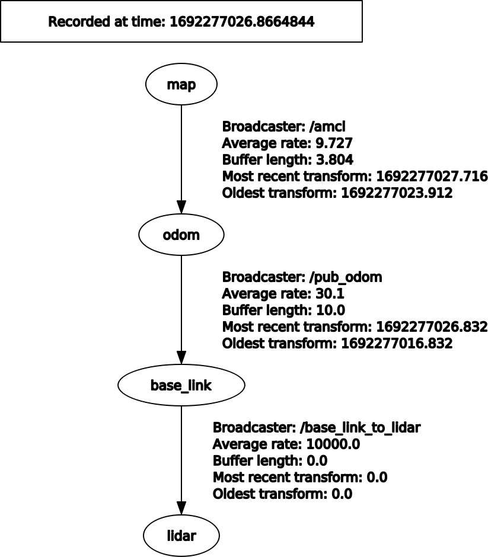

# SLAM & Navigation Exercises

Please conduct excercises below in **./slam_kw_ws** folder.  

## How to SLAM(use Gmapping)
- First of all, you need to connect ROS Noetic and Morai Simulation using rosbridge. Of course, you need to attach LiDAR sensor to your scout_mini. After this process, you need to reconnect the Network(F4) and Sensor(F3) settings in Morai Simulation.
- Then, publish the tf information using tf_setting.launch in kw_tf package.
- Make 3D Pointcloud LiDAR data to 2D Laserscan topic using smaple_node.launch in pointcloud_to_laserscan package.
- Finally, run Gmapping SLAM using slam_gmapping_pr2.launch
- After mapping is finished, save the map.
```
roslaunch rosbridge_server rosbridge_websocket.launch
roslaunch kw_tf tf_setting.launch
roslaunch pointcloud_to_laserscan sample_node.launch
roslaunch gmapping slam_gmapping_pr2.launch
rosrun map_server map_saver
```


## How to use Navigation
- First of all, you need to connect ROS Noetic and Morai Simulation using rosbridge. After this process, you need to reconnect the Network(F4) and Sensor(F3) settings in Morai Simulation.
- Then, publish the tf information using tf_setting.launch in kw_tf package.
- Make 3D Pointcloud LiDAR data to 2D Laserscan topic using smaple_node.launch in pointcloud_to_laserscan package.
- Finally, conduct navigation on rviz using navigation.launch in kw_tf package.  
```
roslaunch rosbridge_server rosbridge_websocket.launch
roslaunch kw_tf tf_setting.launch
roslaunch pointcloud_to_laserscan sample_node.launch
roslaunch kw_tf navigation.launch
```

additionally, I made ./slam_kw_ws/src/kw_tf/scripts/application.py. This file will conduct a ratationuous moving using 3 points in the map. You can conduct it use the command below.
```
cd ./slam_kw_ws/src/kw_tf/ && python3 application.py
```
  
    
For your understanding, on Navigation procedure, each TF Broadcaster is like below.  
- map to odom: amcl from navigation.launch
- odom to base_link: pub_odom.py from tf_setting.launch
- base_link to lidar: static_transform_publisher from tf_setting.launch  
